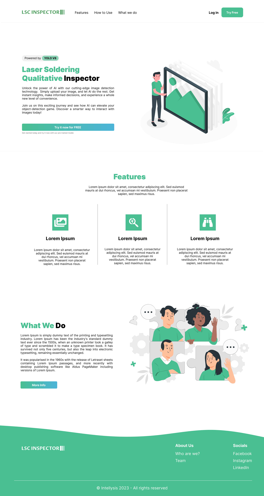
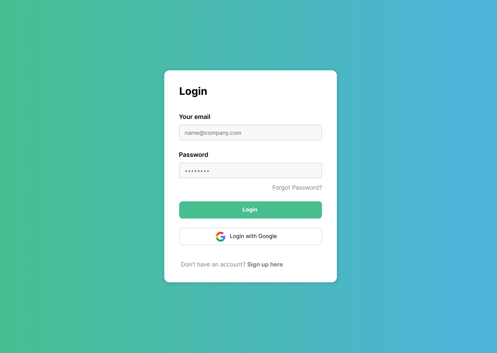
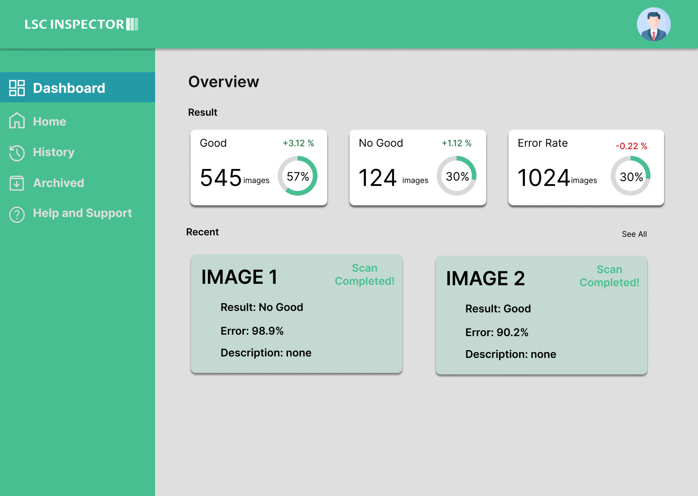
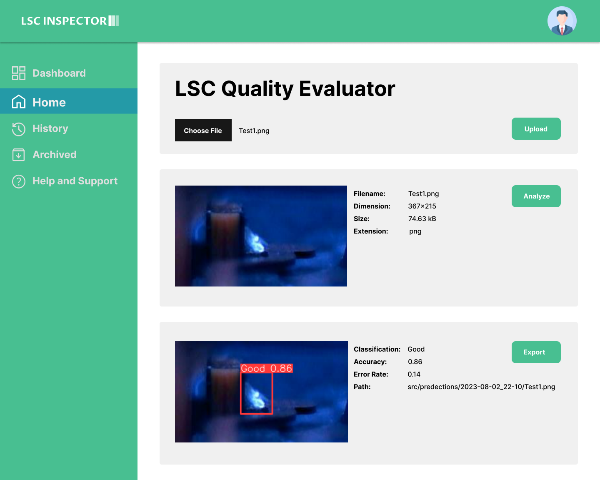
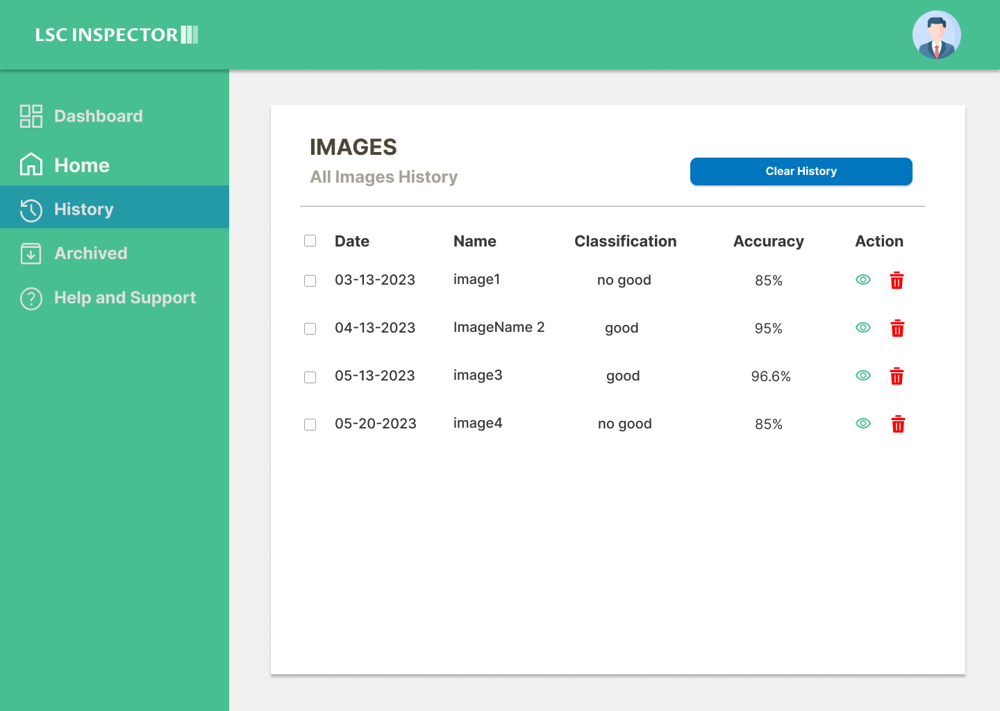
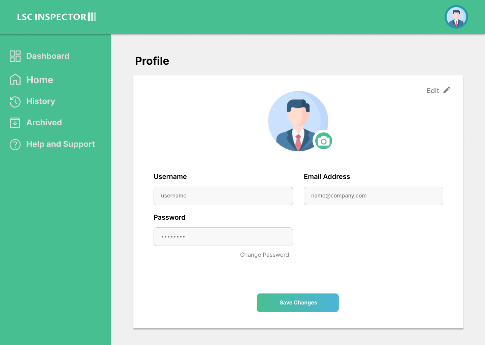

# LSC Inspector Frontend - NextJS
by **Team 2324-softeng2-sem1-f1-08** of CIT-U composed of:
- Acojedo, Jhonray
- Labajo, Kerr
- Leonor, Jie Ann
- Montayre, Queen Riza
- Yanson, Raul Jay

> This project was a compliance for the course **Software Engineering 2 Section F1** under the supervision of **Sir Ralph P. Laviste** during the First Semester of the Academic Year 2023-2024.

## Description

**Laser Soldering Condition Inspector (LSC Inspector)** is a project with the purpose of developing an automated system that can evaluate the quality of laser solder joint that is applied to a micro-component. The system will analyze images of solder joints and process it with machine learning to determine the quality of the solder joint. As for this repository, this serves as the backend of the project being run on Flask.

> This is a [Next.js](https://nextjs.org/) project bootstrapped with [`create-next-app`](https://github.com/vercel/next.js/tree/canary/packages/create-next-app).

## Getting Started

### Prerequisites

- NodeJS 16.13.0
- npm 8.1.0

### Installation

1. Clone the repository:
```sh
git clone https://github.com/Ra-Jay/next_lsc_inspector.git
```

2. Navigate to the project directory:
```sh
cd next_lsc_inspector
```

3. Install the required packages:
```sh
npm install --legacy-peer-deps
```

4. Set the environment variables:
```sh
cp .env.example .env.local
```

## Usage
Run the development server:
```bash
npm run dev
# or
yarn dev
# or
pnpm dev
```
Open [http://localhost:3000](http://localhost:3000) with your browser to see the result.

## Pages
- Landing Page
[](https://i.ibb.co/7Rz3z3V/Use-Case-Diagram.png)

- Login Page
[](https://i.ibb.co/7Rz3z3V/Use-Case-Diagram.png)

- Register Page
[](https://i.ibb.co/7Rz3z3V/Use-Case-Diagram.png)

- Dashboard Page
[](https://i.ibb.co/7Rz3z3V/Use-Case-Diagram.png)

- Main Page
[](https://i.ibb.co/7Rz3z3V/Use-Case-Diagram.png)

- History Page
[](https://i.ibb.co/7Rz3z3V/Use-Case-Diagram.png)

- Profile Page
[](https://i.ibb.co/7Rz3z3V/Use-Case-Diagram.png)

## Docker
A Dockerfile is included for building a Docker image of the application. To build and push the Docker image, use the provided `build_and_push.sh` script.

## Deployment
> The deployment of this application was done using Amazon Web Services (AWS) Elastic Computing Cloud (EC2) service to which hosts the API for the [Flask Backend Project](https://github.com/Ra-Jay/flask_lsc_inspector)
